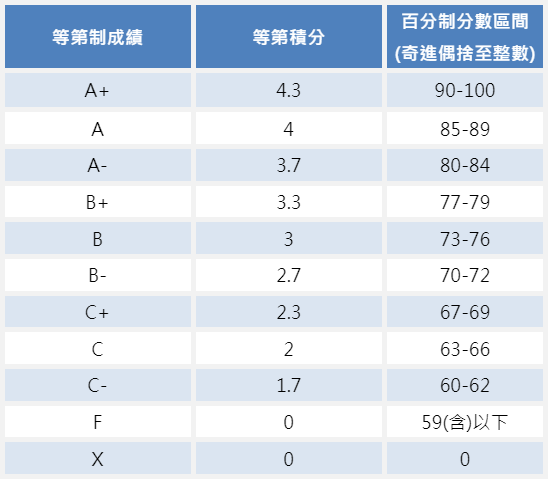

# 小仔算成績

## Description

小仔這學期修「程式設計與資料擷取」這門通識課，請依照他的成績幫他算算看最後拿的等第成績吧。

這門課程的評分包括作業、考試和期末專案。作業佔總成績 50%，有 6 次作業（取最高分 5 次作業平均)，若有某次作業成績標示為 -1，表示小仔被助教抓到該次作業為抄襲(小仔抄襲至多 1 次)，則該次作業以 0 分計算，且最後學期成績扣兩個等第分數(A -> B、C -> F)，作業平均過後超過 100 分，以 100 分計；有 2 次期中考試，較高分的考試成績佔總成績 15%，較低分的考試成績佔總成績 10%，兩次考試超過 100 分，皆以 100 分計；其期末專案成績佔總成績 25%。在算出學期成績後，依下表計算出該分數的等第制成績。



## Input

共 3 行，

第 1 行，包含 6 整數，分別為 6 次作業成績，中間以空白隔開。

第 2 行，包含 2 整數，分別為 2 次期中考成績，中間以空白隔開。

第 3 行，包含 1 整數，為期末專案成績。

## Output

共 1 行，輸出 1 整數和 1 字串，分別為學期百分制成績(奇進偶捨至整數)和等第成績，中間以空白隔開

## Sample Input / Output

```py
100 100 93 90 80 -1
110 60
85

89 B+
```
```py
50 80 67 49 100 100 
85 80
90

83 A-
```

## Hint

奇進偶捨類似四捨五入但更精確，使用 round() 即可實作，更多說明請看 [這裡](https://zh.wikipedia.org/wiki/%E5%A5%87%E9%80%B2%E5%81%B6%E6%8D%A8)